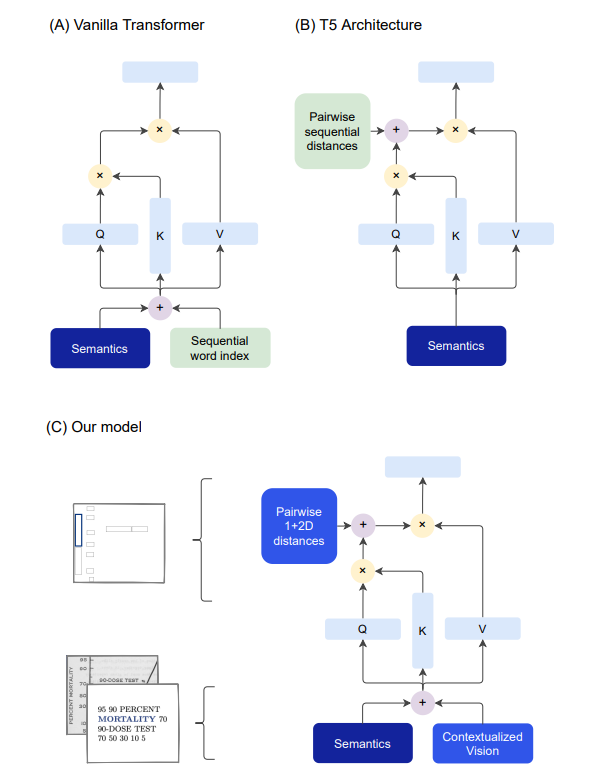

## Going Full-TILT Boogie on Document Understanding with Text-Image-Layout Transformer: PyTorch Implementation



This repository contains the implementation of the paper: [Going Full-TILT Boogie on Document Understanding with Text-Image-Layout Transformer](https://arxiv.org/pdf/2102.09550v3.pdf). Note that, the authors have not released the original implementation of the paper.

Abstract: We address the challenging problem of Natural Language Comprehension beyond plain-text documents by introducing the TILT neural network architecture which simultaneously learns layout information, visual features, and textual semantics. Contrary to previous approaches, we rely on a decoder capable of unifying a variety of problems involving natural language. The layout is represented as an attention bias and complemented with contextualized visual information, while the core of our model is a pretrained encoder-decoder Transformer. Our novel approach achieves state-of-the-art results in extracting information from documents and answering questions which demand layout understanding (DocVQA, CORD, SROIE). At the same time, we simplify the process by employing an end-to-end model.


## Requirements
* See in the requirements.txt file


## Dataset
* I would be including the [FUNSD Dataset](https://guillaumejaume.github.io/FUNSD/), as well as the [CORD Dataset](https://github.com/clovaai/cord) soon. Currently, the entire approach is being implemented, and due to my silly mistakes, it would take me a while to prepare the entire pipeline.


## Pretrained Models
* I am not sure, if I would be able to include the pretrained models, due to resource constraints, but would add the finetuning code for FUNSD, CORD and DocVQA soon.


## Modeling:
* The modeling part of the pipeline, basically is inspired from [HuggingFace's T5 implementation](https://huggingface.co/docs/transformers/model_doc/t5), and the initialization of the weights are being done from the same. The code for the same is available in the `modeling.py` file.


## Examples:
* Would be adding the examples soon.

## My Results:

## Citation
If you find this repository useful, please cite the following paper:
```bibtex
@inproceedings{powalski2021going,
  title={Going full-tilt boogie on document understanding with text-image-layout transformer},
  author={Powalski, Rafa{\l} and Borchmann, {\L}ukasz and Jurkiewicz, Dawid and Dwojak, Tomasz and Pietruszka, Micha{\l} and Pa{\l}ka, Gabriela},
  booktitle={Document Analysis and Recognition--ICDAR 2021: 16th International Conference, Lausanne, Switzerland, September 5--10, 2021, Proceedings, Part II 16},
  pages={732--747},
  year={2021},
  organization={Springer}
}
```

## License
This project is licensed under the MIT License - see the LICENSE file for details
